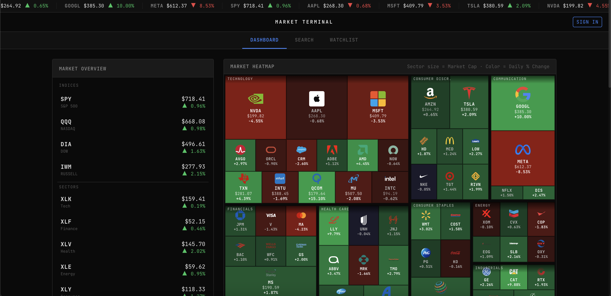

# Market Terminal

A real-time stock market dashboard with a Bloomberg/trading-terminal aesthetic, powered by live WebSocket data and AI-driven stock analysis.

**Live demo → [stock-market-dashboard-sage.vercel.app](https://stock-market-dashboard-sage.vercel.app)**



---

## Features

- **Live ticker bar** — scrolling marquee with real-time prices via WebSocket
- **Market heatmap** — sector-grouped tiles sized by market cap, colored by daily change; click any tile to open the stock detail panel
- **Stock detail page** — price chart (1D / 1W / 1M), OHLV stats, news feed, and AI insights
- **AI stock insights** — Claude-powered analysis with signal (Strong Buy → Strong Sell), confidence score, sentiment, and 4 data-driven reasoning bullets
- **Crypto support** — real-time prices and charts for major cryptocurrencies
- **News feed** — latest articles per ticker from Alpaca's news API
- **Stock search** — search any ticker by symbol or company name
- **Watchlist** — add/remove tickers with live price updates (auth required)
- **Portfolio tracker** — track positions with real-time P&L calculations (auth required)
- **Supabase Auth** — email/password sign in & sign up

---

## Stack

| Layer | Technology |
|-------|-----------|
| Framework | Next.js 14 (App Router, TypeScript) |
| Styling | Tailwind CSS |
| Charts | lightweight-charts v4 |
| Auth & DB | Supabase (Postgres + Auth) |
| Market data | Alpaca Markets API (REST + WebSocket) |
| AI analysis | Anthropic Claude (claude-haiku-4-5) |
| Deployment | Vercel |

---

## Project Structure

```
app/
├── api/
│   ├── insights/route.ts           # AI stock analysis (Anthropic API)
│   ├── snapshots/route.ts          # Batch price snapshots
│   ├── crypto/
│   │   ├── bars/route.ts           # Crypto historical bars
│   │   └── snapshots/route.ts      # Crypto price snapshots
│   ├── stock/[ticker]/
│   │   ├── bars/route.ts           # Historical bar data
│   │   ├── news/route.ts           # News articles
│   │   └── snapshot/route.ts       # Single-stock snapshot
│   ├── watchlist/route.ts          # Watchlist CRUD
│   ├── portfolio/route.ts          # Portfolio CRUD
│   └── news/route.ts               # General news feed
├── stock/[ticker]/page.tsx         # Stock detail page
├── crypto/[symbol]/page.tsx        # Crypto detail page
├── search/page.tsx                 # Ticker search
├── watchlist/page.tsx              # Watchlist page
├── layout.tsx
└── page.tsx                        # Home (heatmap + overview)

components/
├── StockHeatmap.tsx                # Sector heatmap with treemap layout
├── StockDetailPanel.tsx            # Slide-in stock detail panel
├── StockInsights.tsx               # AI analysis panel
├── StockChart.tsx                  # lightweight-charts wrapper
├── NewsPanel.tsx                   # News feed
├── MarketOverview.tsx              # Indices + sector overview
├── TickerBar.tsx                   # Scrolling live ticker marquee
├── Watchlist.tsx                   # Watchlist panel
├── PortfolioTable.tsx              # Portfolio table with live P&L
├── SearchBar.tsx                   # Ticker search input
├── Header.tsx                      # Top nav
├── AuthProvider.tsx                # Supabase auth context + useAuth hook
├── AuthModal.tsx                   # Sign in / sign up modal
├── AddPositionModal.tsx            # Add/edit portfolio position
├── PriceDisplay.tsx                # Formatted price + change
└── Skeleton.tsx                    # Loading skeleton components

lib/
├── alpaca.ts                       # Alpaca REST helpers
├── alpacaSocket.ts                 # WebSocket singleton manager
├── tickers.ts                      # Tracked ticker list
├── treemap.ts                      # Heatmap layout algorithm
├── supabase.ts                     # Browser Supabase client
├── supabase-server.ts              # Server Supabase client (API routes)
└── utils.ts                        # Price formatting, date helpers

types/index.ts                      # Shared TypeScript interfaces
middleware.ts                       # Supabase session refresh
supabase-schema.sql                 # Database schema + RLS policies
```

---

## Local Setup

### 1. Clone & install

```bash
git clone https://github.com/alexmekhail/StockMarket.git
cd StockMarket
npm install
```

### 2. Set up environment variables

```bash
cp .env.local.example .env.local
```

Fill in `.env.local`:

```env
# Alpaca Markets API (server-side REST calls)
ALPACA_API_KEY=your_alpaca_key_id
ALPACA_API_SECRET=your_alpaca_secret

# Alpaca Markets API (client-side WebSocket streaming)
# These are exposed to the browser — use a read-only market data key
NEXT_PUBLIC_ALPACA_API_KEY=your_alpaca_key_id
NEXT_PUBLIC_ALPACA_API_SECRET=your_alpaca_secret

# Supabase
NEXT_PUBLIC_SUPABASE_URL=https://your-project.supabase.co
NEXT_PUBLIC_SUPABASE_ANON_KEY=your_anon_key
SUPABASE_SERVICE_ROLE_KEY=your_service_role_key

# Anthropic (optional — enables AI stock insights)
ANTHROPIC_API_KEY=your_anthropic_api_key
```

> **Note:** If `ANTHROPIC_API_KEY` is omitted, the AI Insights panel shows a graceful fallback. All other features work without it.

### 3. Set up Supabase database

In your Supabase project, go to **SQL Editor** and run [`supabase-schema.sql`](./supabase-schema.sql).

This creates the `watchlist` and `portfolio` tables with Row Level Security policies.

### 4. Run locally

```bash
npm run dev
```

Open [http://localhost:3000](http://localhost:3000).

---

## Deployment (Vercel)

### Manual deploy

```bash
npm install -g vercel
vercel link
vercel --prod
```

Set all environment variables in the Vercel dashboard under **Project → Settings → Environment Variables**.

### GitHub Actions CI/CD

The workflow in [`.github/workflows/deploy.yml`](./.github/workflows/deploy.yml) deploys to Vercel on every push to `main`.

**Required GitHub Actions secrets:**

| Secret | Where to find it |
|--------|-----------------|
| `VERCEL_TOKEN` | Vercel → Account Settings → Tokens |
| `VERCEL_ORG_ID` | `.vercel/project.json` after `vercel link` |
| `VERCEL_PROJECT_ID` | `.vercel/project.json` after `vercel link` |
| `NEXT_PUBLIC_SUPABASE_URL` | Supabase → Project Settings → API |
| `NEXT_PUBLIC_SUPABASE_ANON_KEY` | Supabase → Project Settings → API |
| `SUPABASE_SERVICE_ROLE_KEY` | Supabase → Project Settings → API |
| `ALPACA_API_KEY` | Alpaca dashboard |
| `ALPACA_API_SECRET` | Alpaca dashboard |
| `NEXT_PUBLIC_ALPACA_API_KEY` | Alpaca dashboard |
| `NEXT_PUBLIC_ALPACA_API_SECRET` | Alpaca dashboard |
| `ANTHROPIC_API_KEY` | [console.anthropic.com](https://console.anthropic.com) → API Keys |

---

## Real-Time Architecture

WebSocket connections are managed by a **client-side singleton** (`lib/alpacaSocket.ts`):

- Connects to `wss://stream.data.alpaca.markets/v2/iex`
- Multiple components subscribe to the same ticker — only one WS subscription per ticker
- Unsubscribes when no components are listening
- Automatically reconnects with 3-second backoff
- Initial prices are fetched via REST so the UI shows data before the WebSocket authenticates

---

## Database Schema

See [`supabase-schema.sql`](./supabase-schema.sql) for the full schema with RLS policies.

```sql
-- Watchlist: one row per user per ticker
watchlist (id, user_id, ticker, created_at)

-- Portfolio: one row per user per ticker (upsert on conflict)
portfolio (id, user_id, ticker, shares, avg_buy_price, created_at)
```

Both tables use Row Level Security — users can only read and write their own rows.
